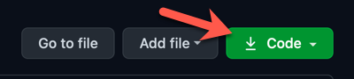

# Accelebrate Video Shorts by T4D.IO

### Automate Code Linting and Unit Testing with Azure Pipelines

[](#)

This demonstration represents some of the content covered in the following React courses taught by [Accelebrate](https://www.accelebrate.com/):

- [Introduction to React using JavaScript/ECMAScript](https://www.accelebrate.com/training/react)
- [Introduction to React using TypeScript](https://www.accelebrate.com/training/react-typescript)
- [Continuous Delivery Using Azure DevOps Services](https://www.accelebrate.com/training/azure-devops-services)


Contact [Accelebrate](https://www.accelebrate.com/contact) today for all of your software development training needs. 

### Project Setup

> All instructions and code in this repository are licensed under the MIT license. Read the license text in the file `license.txt` to learn more.

The provided files are the start and finish files for the video. If you desire to code along with the instructor, [Eric Greene](http://www.t4d.io), clone this repository, open the `start` folder in your code editor and get started with the [YouTube Video](#). If you prefer to review only the completed files then browse the `finish` folder. 

**Note:** Before watching the video and coding along you will need to setup your local environment. Within the instructions the word `terminal` refers to the Windows Command Prompt program on Windows and the Terminal program on macOS

**Step 1.** First, you will need to ensure you have Node.js 14.16.1 installed. Other versions of Node.js may work, but if you have any problems then please revert to version 14.16.1 as this is version used in the video. To verify if Node.js is installed on your system open a terminal window, and run the follow the command:

```
node -v
```

If your system returns back a version number other than 14.16.1 or cannot find Node.js then you will need to install Node.js 14.16.1. To install using the system installer, please browse to the appropriate link below. The system installer only supports one version being installed on a system at a time.

To download Node.js for:

- 64-bit Windows: [node-v14.16.1-x64.msi](https://nodejs.org/dist/v14.16.1/node-v14.16.1-x64.msi)
- macOS: [node-v14.16.1.pkg](https://nodejs.org/dist/v14.16.1/node-v14.16.1.pkg)
- For all other platforms, look for the appropriate download here: [other platforms](https://nodejs.org/dist/v14.16.1/)

Once you download the Node.js installer, run the installer and complete the installation process.

Repeat the `node -v` command from a new terminal window to confirm Node.js was installed successfully.

> Helpful Hint: If you need to run multiple versions of Node.js on your system consider using [NVM-Windows](https://github.com/coreybutler/nvm-windows) (for Windows) and [NVM](https://github.com/nvm-sh/nvm) (for macOS)

**Step 2.** Clone or download this code respository. To clone this repository, open a terminal window and run the following command:

```
git clone https://github.com/t4d-accelebrate-video-shorts/react-memo.git
```

> If `git` cannot be found on your system then please visit the Git website to install it: [https://git-scm.com](https://git-scm.com) 

If you prefer to not use Git then the repository can be downloaded by clicking the following link on the code repository's GitHub page:



Extract the downloaded archive file in the folder of your choice.

**Step 3.** Open the `start` folder in the editor of your choice. We recommended [Visual Studio Code](http://code.visualstudio.com/). It works on Windows, macOS and Linux. It is open source and free. However, any editor can be used. It is recommended to use an editor with a built-in file tree, a built-in terminal window and support for React's JSX syntax.

**Step 4.** Install the NPM packages for the project. From a terminal window within the `start` folder run the following command:

```
npm install
```

**Step 5.** Start the development web server for the React application. From a terminal window within the `start` folder, run the following command:

```
npm start
```

When the development web server starts, it should open the React web site in your default web browser. The url will be [http://localhost:3000](http://localhost:3000)

**Step 6.** Start watching the [YouTube Video](#) and code along to learn more about how to use Azure Pipelines to implement automatic code linting and unit test execution on Git pull requests.


